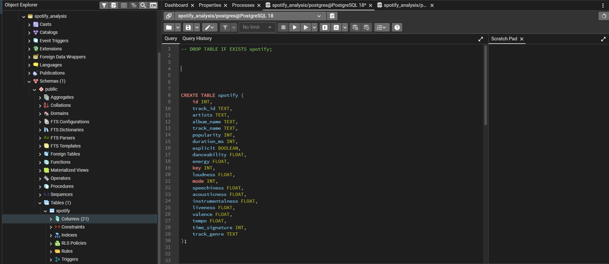
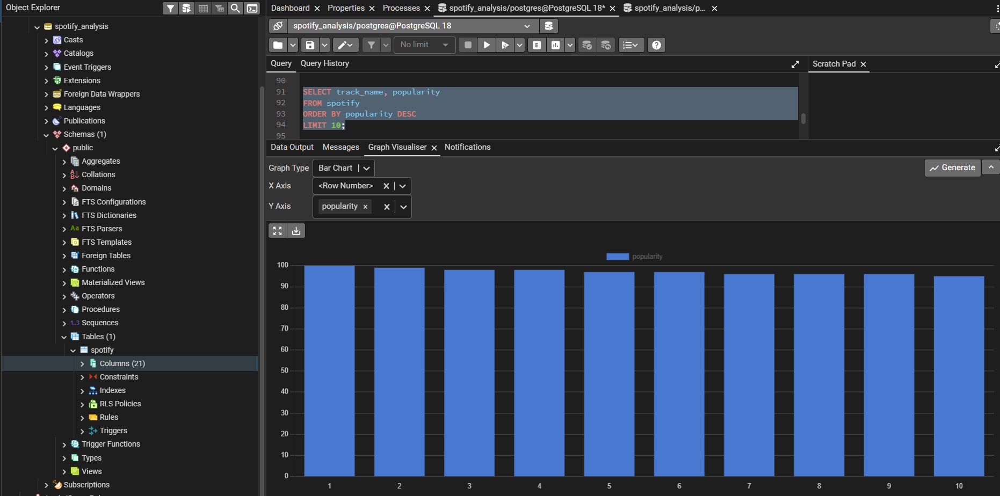
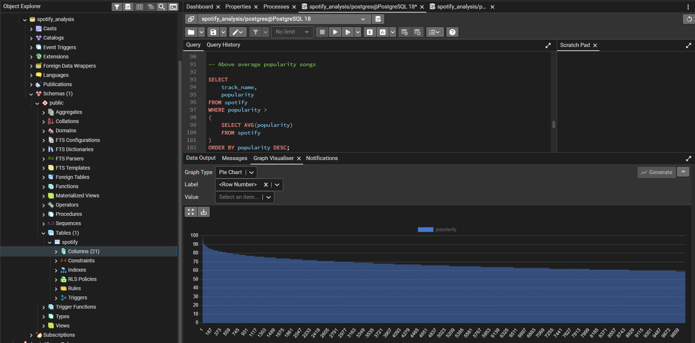

# Spotify SQL Analytics Project

## Overview

This project is an end-to-end SQL data analytics project built using PostgreSQL and a Spotify songs dataset.

The goal of this project is to analyze music data, generate business insights, and practice advanced SQL concepts used in real-world data analysis workflows.

---

## Objectives

* Practice advanced SQL concepts
* Analyze real-world Spotify data
* Generate business insights
* Improve query optimization skills
* Build a portfolio-ready data analytics project

---

## Tech Stack

* PostgreSQL
* SQL
* pgAdmin 4
* Git
* GitHub

---

## Project Structure

```bash
spotify-sql-analysis/
│
├── dataset/
│   └── spotify_dataset.csv
│
├── sql/
│   ├── 01_create_table.sql
│   ├── 02_data_cleaning.sql
│   ├── 03_basic_analysis.sql
│   ├── 04_intermediate_analysis.sql
│   ├── 05_advanced_analysis.sql
│   ├── 06_business_insights.sql
│   └── 07_query_optimization.sql
│
├── screenshots/
│   ├── schema.png
│   ├── queries.png
│   └── insights.png
│
├── README.md
└── .gitignore
```

---

## Dataset Information

The dataset contains Spotify track information including:

* Track Name
* Artist Name
* Album Name
* Popularity
* Danceability
* Energy
* Loudness
* Tempo
* Genre
* Explicit Content
* Duration

---

## Database Schema

```sql
CREATE TABLE spotify (
    id INT,
    track_id TEXT,
    artists TEXT,
    album_name TEXT,
    track_name TEXT,
    popularity INT,
    duration_ms INT,
    explicit BOOLEAN,
    danceability FLOAT,
    energy FLOAT,
    key INT,
    loudness FLOAT,
    mode INT,
    speechiness FLOAT,
    acousticness FLOAT,
    instrumentalness FLOAT,
    liveness FLOAT,
    valence FLOAT,
    tempo FLOAT,
    time_signature INT,
    track_genre TEXT
);
```

---

## SQL Concepts Used

* Filtering and Sorting
* Aggregations
* GROUP BY
* Subqueries
* CTEs
* Window Functions
* CASE Statements
* Query Optimization
* Indexing

---

## Analysis Performed

### Basic Analysis

* Total tracks
* Most popular songs
* Genre distribution
* Explicit vs non-explicit songs

### Intermediate Analysis

* Average danceability by genre
* Energy analysis
* Artist analysis
* Genre popularity trends

### Advanced Analysis

* Top songs per genre using window functions
* CTE-based analysis
* Above-average popularity analysis
* Query optimization using indexes

---

## Business Insights

* Most popular genres
* Most energetic genres
* Listening behavior trends
* Popularity impact of explicit songs
* High engagement music characteristics

---

## Query Optimization

Indexes were created on:

```sql
track_name
track_genre
popularity
```

`EXPLAIN ANALYZE` was used to evaluate query performance.

---

## Screenshots

### Database Schema



### SQL Query Execution



### Analysis Results



---

## How to Run

### 1. Clone Repository

```bash
git clone https://github.com/ishikagup26/Spotify-User-Engagement-Analysis-using-PostgreSQL.git
```

### 2. Create Database

```sql
CREATE DATABASE spotify_analysis;
```

### 3. Run SQL Scripts

Execute the SQL files in order:

```bash
01_create_table.sql
02_data_cleaning.sql
03_basic_analysis.sql
04_intermediate_analysis.sql
05_advanced_analysis.sql
06_business_insights.sql
07_query_optimization.sql
```

### 4. Import Dataset

Import `spotify_dataset.csv` into PostgreSQL.

---

## Key Learnings

* Real-world SQL workflows
* PostgreSQL database management
* Data cleaning techniques
* Analytical SQL querying
* Window Functions and CTEs
* Query optimization
* Git and GitHub workflow

---

## Future Improvements

* Power BI dashboard
* Tableau dashboard
* Interactive visualizations
* Stored procedures
* Materialized views
* Advanced performance optimization

---

## Author

Ishika Gupta

GitHub: https://github.com/ishikagup26

LinkedIn: https://www.linkedin.com/in/ishika-gupta-5a29b4289/
